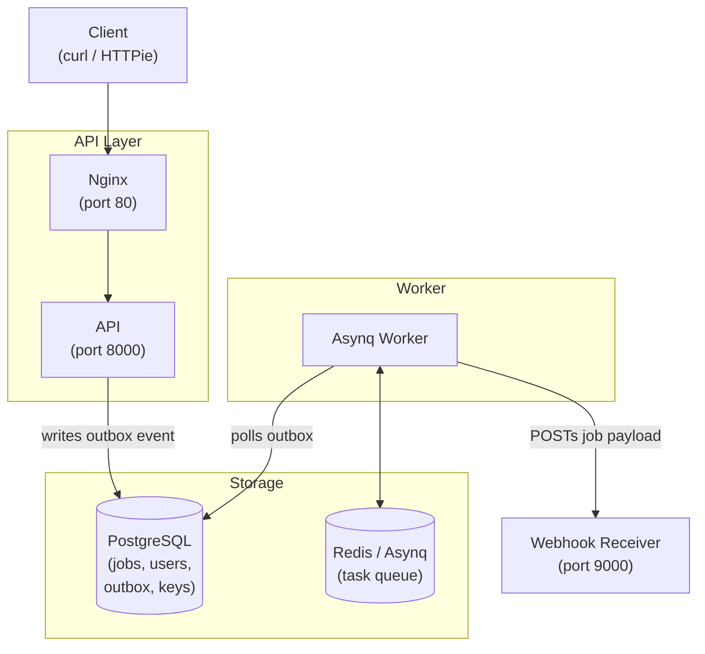
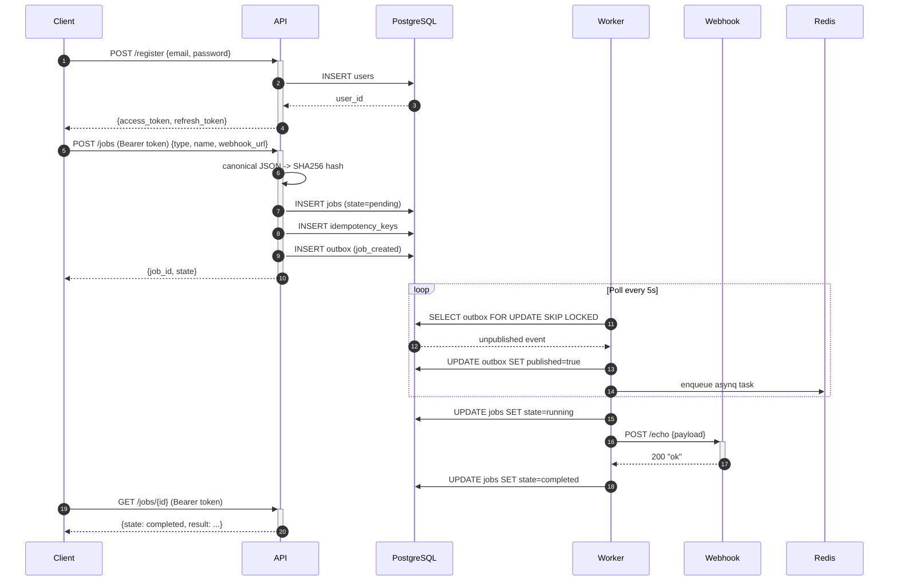

# Assignment

An async job processing REST API built in Go. This service accepts job registrations, processes them asynchronously via an outbox + Redis-backed task queue, and POSTs job payloads to user-specified webhook URLs.

## Architecture



### Components

| Component | Port | Description |
|---|---|---|
| **API** | `:8000` | REST API — register/login users, CRUD jobs |
| **Worker** | — | Asynq worker that polls the outbox and executes job webhooks |
| **Webhook** | `:9000` | Echo receiver for testing (`POST /echo` returns `"ok"`) |
| **PostgreSQL** | `:5432` | Primary data store — users, jobs, idempotency keys, outbox |
| **Redis** | `:6379` | Asynq task queue and result backend |
| **Nginx** | `:80` | Reverse proxy to the API |

## API Endpoints

All endpoints are documented via Swagger UI at [http://localhost:8000/swagger/index.html](http://localhost:8000/swagger/index.html).

| Method | Path | Auth | Description |
|---|---|---|---|
| `GET` | `/health` | — | Health check |
| `POST` | `/register` | — | Create account (returns JWT) |
| `POST` | `/login` | — | Authenticate (returns JWT) |
| `POST` | `/jobs` | Bearer | Create a job (idempotent) |
| `GET` | `/jobs` | Bearer | List user's jobs (paginated) |
| `GET` | `/jobs/{id}` | Bearer | Get job details |
| `PUT` | `/jobs/{id}` | Bearer | Update job fields |
| `DELETE` | `/jobs/{id}` | Bearer | Delete a job |
| `GET` | `/swagger/*` | — | Swagger UI |

### Authentication

All `/jobs/*` routes require `Authorization: Bearer <token>`.

Tokens are **HMAC-SHA256 JWTs** signed with the `JWT_SECRET` env var.
- Access token: 15 minute expiry, contains `sub` (user ID) and `email`.
- Refresh token: 7 day expiry, contains `sub` only.

## Flow



### Key points
- Job creation is **idempotent** — identical payloads return the same `job_id` with HTTP 200 instead of 202.
- The **outbox pattern** guarantees at-least-once delivery of job events to the worker.
- **Row-level locking** (`FOR UPDATE SKIP LOCKED`) prevents duplicate outbox polling.
- Failed jobs are **automatically retried** up to `max_retries` times via a separate outbox event (`job_retry`).

## Key Decisions

| Decision | Rationale |
|---|---|
| **Idempotency via canonical JSON hash** | SHA256 of sorted-key JSON guarantees the same logical payload always maps to the same hash, regardless of key order in the request. Idempotency keys expire after 24 hours. |
| **Outbox pattern** | Writing to an outbox table in the same DB transaction as the job insert ensures we never lose a job event. The worker polls and dispatches to Redis/Asynq, decoupling the API from task execution. |
| **Asynq (Redis) for task queue** | Lightweight, Redis-native, supports delayed tasks, retries, and result storage without needing Kafka/RabbitMQ. |
| **Chi router** | Minimal, idiomatic Go router with middleware chaining. No heavy framework overhead. |
| **JWT authentication** | HMAC-SHA256 tokens are simple, fast, and require no external dependency. Tokens carry `sub` and `email` claims. |
| **Row-level locking with SKIP LOCKED** | Prevents multiple worker pollers from picking the same outbox event — critical for horizontal scaling of workers. |
| **Defaults: 5 retries, 15s timeout** | Sensible starting point for webhook calls. Configurable per job. |

## Known Limitations

| Limitation | Impact | Workaround |
|---|---|---|
| **Single worker concurrency pool** | All job types share the same 10 Goroutines. A slow webhook blocks other jobs. | Add per-queue concurrency in Asynq config, or route by job type. |
| **No job scheduling / cron** | Jobs are processed immediately. No delayed or recurring execution. | Add a scheduling column + periodic poller, or use an external scheduler like `gocron`. |
| **No webhook retry backoff** | Retries fire immediately on next poll cycle (~5s). Could flood a down webhook. | Implement exponential backoff (e.g. `min(pow(2, attempt), 3600)` seconds delay). |
| **No webhook signature / HMAC** | Webhook receivers can't verify the request came from this service. | Sign the payload with a shared secret (e.g. `X-Signature: sha256(secret+body)`). |
| **In-memory swagger docs** | The `docs/` package is generated at build time and must be re-generated after handler changes. | Add `//go:generate swag init` to the Makefile. |
| **Idempotency keys never cleaned** | Keys expire at DB level after 24h but no background cleanup of expired rows. | Add a cron or periodic DELETE of `expires_at < now()`. |

## Running

### Prerequisites

- Go 1.26+
- Docker & Docker Compose

### Quick start (Docker Compose)

```bash
docker compose up -d
```

This starts all services: PostgreSQL, Redis, webhook receiver, API, and worker. The API is available at `http://localhost:8000`.

### Verify it's running

```bash
curl http://localhost:8000/health
# {"message":"ok"}
```

### Environment variables

| Variable | Required | Default | Description |
|---|---|---|---|
| `DATABASE_URL` | Yes | — | Postgres connection string |
| `JWT_SECRET` | Yes | — | HMAC-SHA256 signing key |
| `PORT` | No | `8000` | HTTP listen port |

The `docker-compose.yml` sets these automatically for development.

## Testing

### E2E test script

```bash
# Ensure services are running
docker compose up -d

# Run the end-to-end test
bash scripts/e2e.sh
```

### Manual testing with HTTPie

See `test-commands.http` (HTTPie) or `test-commands.sh` in the repo root for a complete set of curl commands covering every endpoint.

### Test flow

1. **Health check**: `GET /health` -> `200 OK`
2. **Register**: `POST /register` with email + password -> `201` + tokens
3. **Create job**: `POST /jobs` with type, name, webhook_url -> `202` + `job_id`
4. **Check status**: Poll `GET /jobs/{job_id}` until `state` is `completed`
5. **Verify webhook**: Check webhook container logs for the received payload

### Swagger UI

Open [http://localhost:8000/swagger/index.html](http://localhost:8000/swagger/index.html) to browse and test all endpoints interactively.

## Deployment

### DigitalOcean

A GitHub Actions workflow (`.github/workflows/deploy.yml`) builds and deploys to a DO Droplet:

1. Push to `main` — CI builds API, worker, and webhook images to GHCR.
2. SSH into the droplet, pulls images, and runs `docker compose up -d`.
3. Nginx on port 80 proxies to the API and serves the Swagger UI.

Required secrets:
- `DO_HOST` — droplet IP
- `DO_USER` — SSH user
- `DO_SSH_KEY` — private key

### Manual deploy

```bash
docker compose build
docker compose up -d
```

## Tech Stack

| Layer | Technology |
|---|---|
| Language | Go 1.26 |
| HTTP Router | Chi v5 |
| Database | PostgreSQL 15 |
| Task Queue | Redis + Asynq |
| Auth | JWT (HS256) |
| Migrations | golang-migrate |
| Logging | Uber Zap |
| Documentation | Swaggo / Swagger UI |
| Container | Docker / Compose |
| Reverse Proxy | Nginx |
